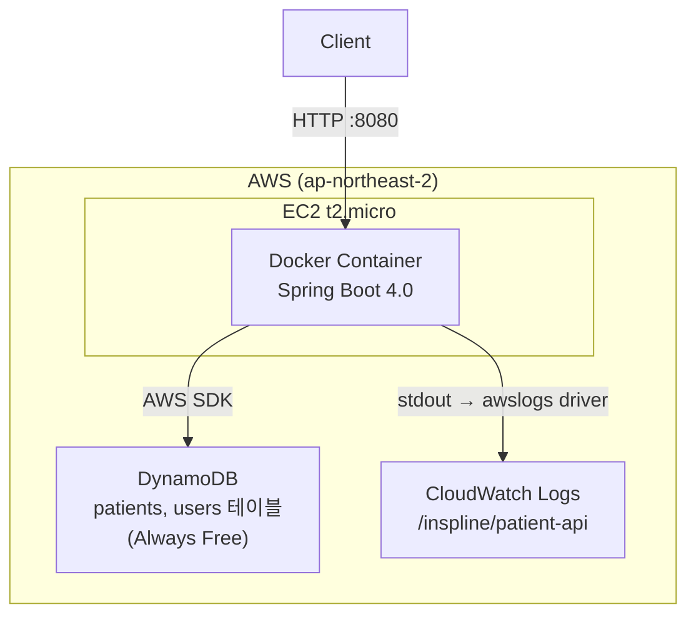
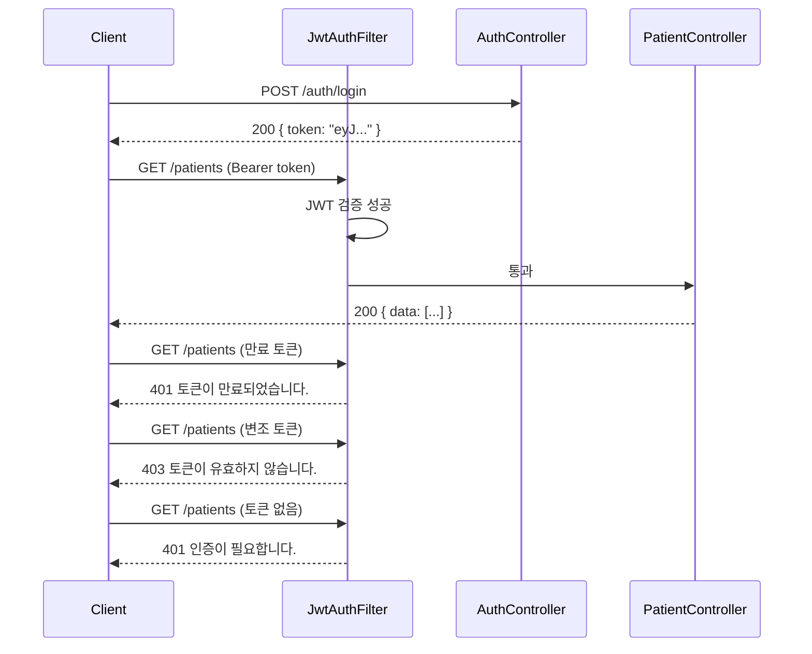
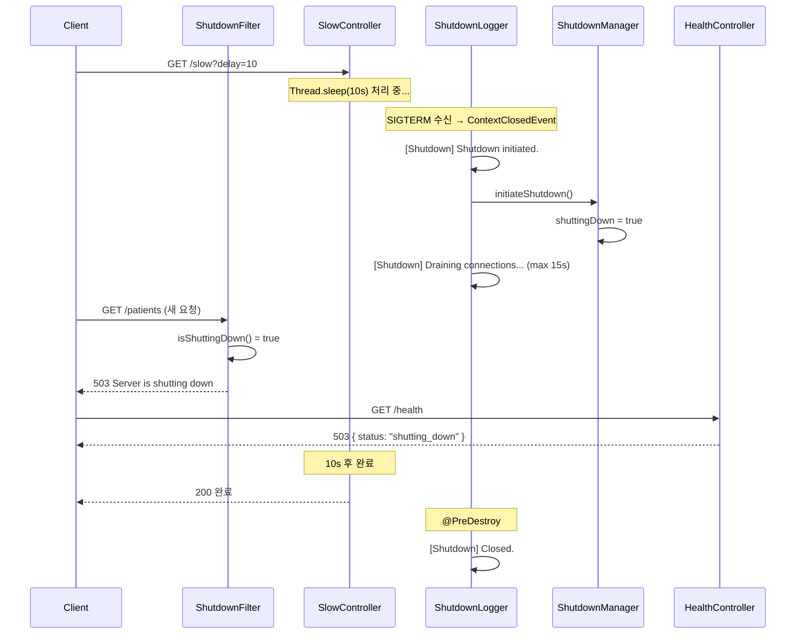

# 아키텍처

## 시스템 구성도



## JWT 인증 흐름



## Graceful Shutdown 흐름



## 패키지 구조

```
src/main/java/com/inspline/patient_api/
├── PatientApiApplication.java
│
├── auth/                          # JWT 인증 도메인
│   ├── AuthController             # POST /auth/login
│   ├── AuthService                # 로그인 처리, JWT 발급
│   ├── JwtProvider                # 토큰 생성/검증
│   ├── JwtAuthFilter              # 요청마다 JWT 검증 (OncePerRequestFilter)
│   ├── dto/
│   │   ├── LoginRequest
│   │   └── LoginResponse
│   └── exception/
│       └── AuthErrorCode
│
├── user/                          # 사용자 도메인 (auth와 분리)
│   ├── UserRepository             (interface)
│   ├── UserRepositoryImpl         # DynamoDB users 테이블
│   └── entity/
│       └── UserEntity
│
├── patient/                       # 환자 도메인
│   ├── PatientController          # GET/POST /patients
│   ├── PatientService             (interface)
│   ├── PatientServiceImpl         # 비즈니스 로직, UUID 기반 ID 생성
│   ├── PatientRepository          (interface)
│   ├── PatientRepositoryImpl      # DynamoDB patients 테이블
│   ├── entity/
│   │   └── PatientEntity
│   ├── dto/
│   │   ├── PatientSummary         # 목록 응답
│   │   ├── PatientDetail          # 상세/생성 응답
│   │   └── CreatePatientRequest
│   └── exception/
│       └── PatientErrorCode
│
└── global/
    ├── config/
    │   ├── SecurityConfig         # JWT 필터 등록, 엔드포인트 접근 제어
    │   ├── DynamoDbConfig         # 로컬/프로덕션 엔드포인트 분기
    │   └── OpenApiConfig          # Swagger UI, JWT Bearer 인증 설정
    ├── exception/
    │   ├── ErrorCode              (interface)
    │   ├── ApplicationException
    │   └── GlobalExceptionHandler
    ├── response/
    │   └── ApiResponse
    ├── health/
    │   ├── HealthController       # GET /health
    │   └── dto/HealthResponse
    ├── shutdown/
    │   ├── ShutdownManager        # shuttingDown 플래그 관리
    │   ├── ShutdownLogger         # SIGTERM 감지, 로그 출력 (@EventListener, @PreDestroy)
    │   └── ShutdownFilter         # Shutdown 진입 시 새 요청 503 반환
    ├── slow/
    │   └── SlowController         # GET /slow?delay=N (Graceful Shutdown 시연)
    └── init/
        ├── DummyDataLoader        # 더미 데이터 insert 공통 로직
        ├── DataInitializer        # @Profile("local"): 테이블 생성 + 데이터 삽입
        └── ProdDataInitializer    # @Profile("prod"): 데이터 삽입만
```

## 설계 결정 근거

**user 패키지를 auth에서 분리한 이유**

`auth`는 인증 행위(로그인, JWT 발급/검증)를 담당하고, `user`는 사용자 데이터(UserEntity, UserRepository)를 담당합니다. 두 책임을 분리해서 나중에 회원가입, 사용자 정보 수정 등으로 확장할 때 `auth`를 수정하지 않아도 됩니다.

**PatientService만 인터페이스로 분리한 이유**

현재 더미 구현체에서 DynamoDB 연동 구현체로, 나아가 외부 EMR 시스템 연동 구현체로 교체 가능성이 있습니다. Controller는 인터페이스에만 의존하므로 구현체가 바뀌어도 Controller 수정이 불필요합니다. AuthService는 JWT 검증 로직이 교체될 시나리오가 없으므로 인터페이스를 분리하지 않았습니다.

**ShutdownFilter를 별도로 분리한 이유**

`ShutdownManager`는 상태 관리, `ShutdownLogger`는 로그 출력, `ShutdownFilter`는 새 요청 차단으로 각 클래스가 단일 책임을 갖습니다. Graceful Shutdown 진입 시 `/health`만 503을 반환하는 것으로는 부족하고, 모든 새 요청을 차단해야 실제 무중단 교체가 가능합니다.

**DataInitializer를 local/prod로 분리한 이유**

로컬은 DynamoDB Local(인메모리)이라 매번 테이블을 새로 만들어야 합니다. 프로덕션은 Terraform이 테이블을 이미 생성하므로 데이터 삽입만 필요합니다. `@Profile`로 분리해서 각 환경에 필요한 로직만 실행합니다.

**DynamoDB 선택 이유**

Always Free(영구 무료)로 과제 기간 제한 없이 사용 가능합니다. RDS t2.micro는 12개월 한정이고 서버 관리가 필요합니다.

**AWS 선택 이유**

Terraform IaC 레퍼런스가 가장 풍부합니다. EC2 + DynamoDB + CloudWatch 조합이 Free Tier 안에서 과제 요구사항을 모두 충족합니다.